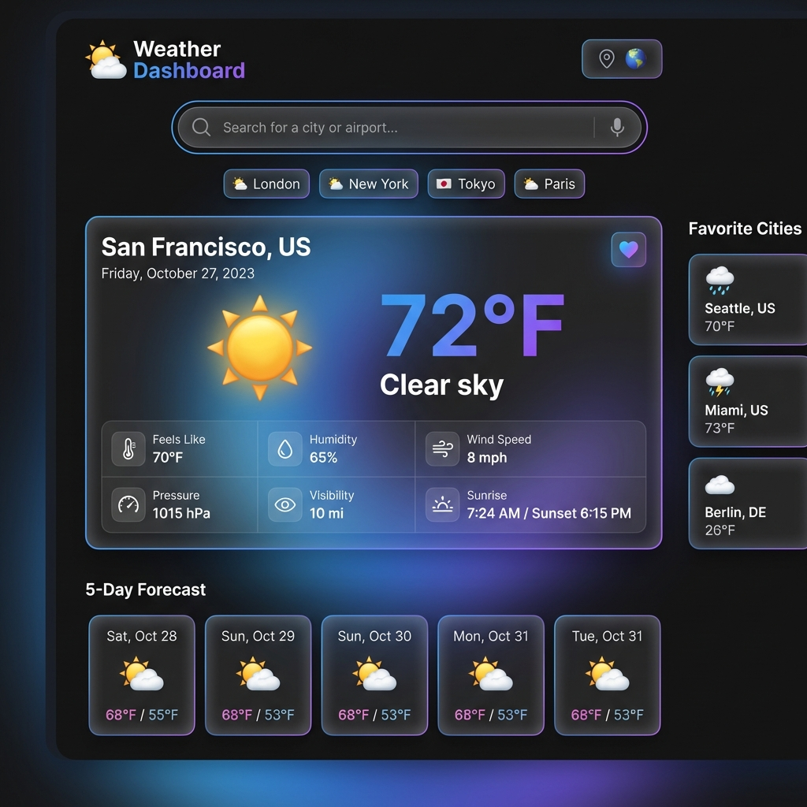
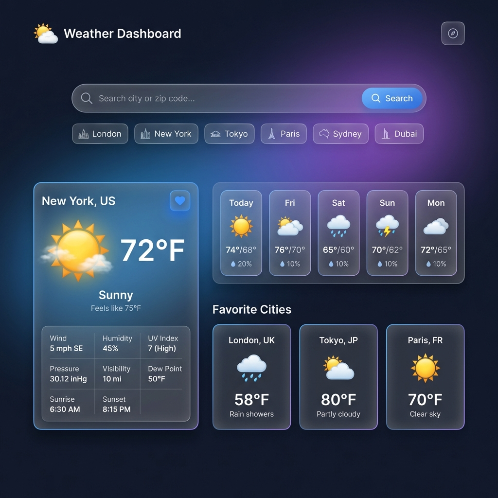
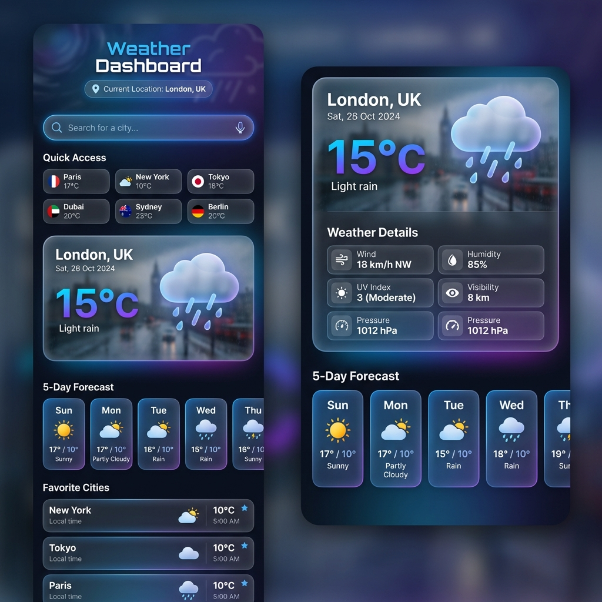
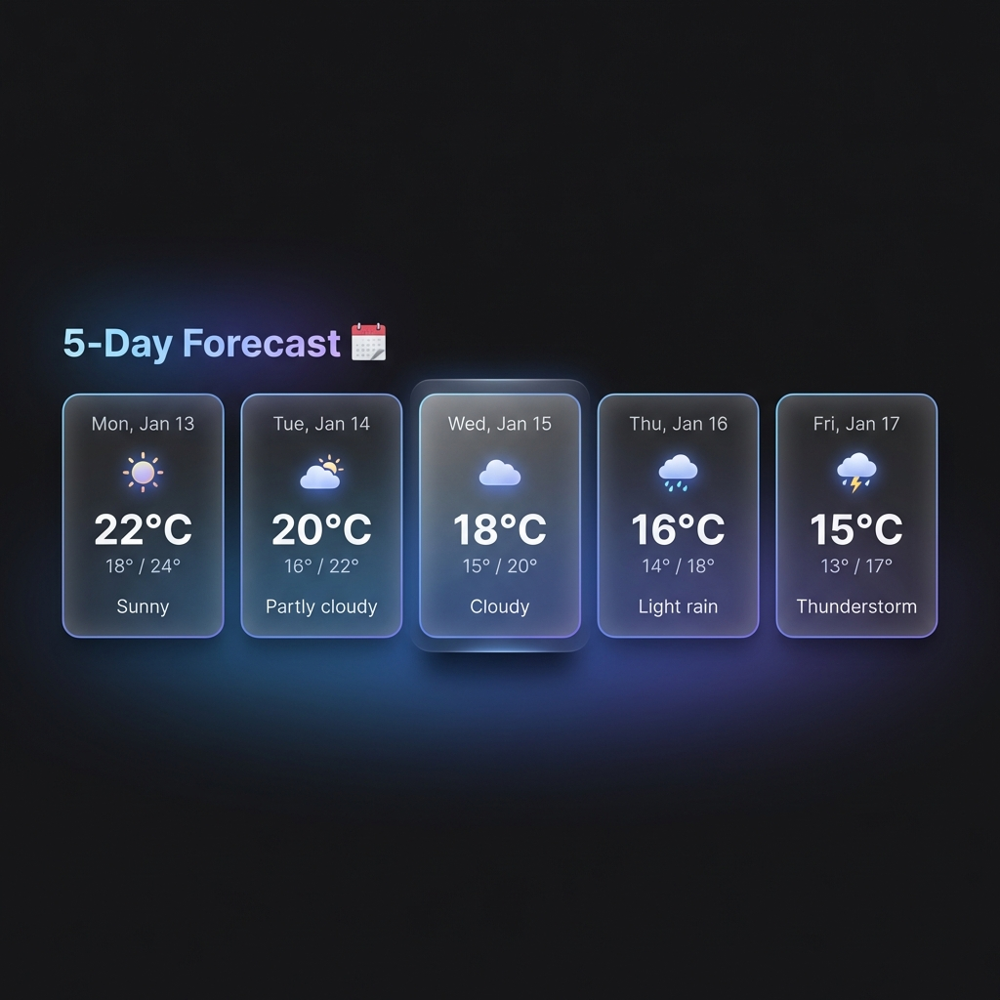
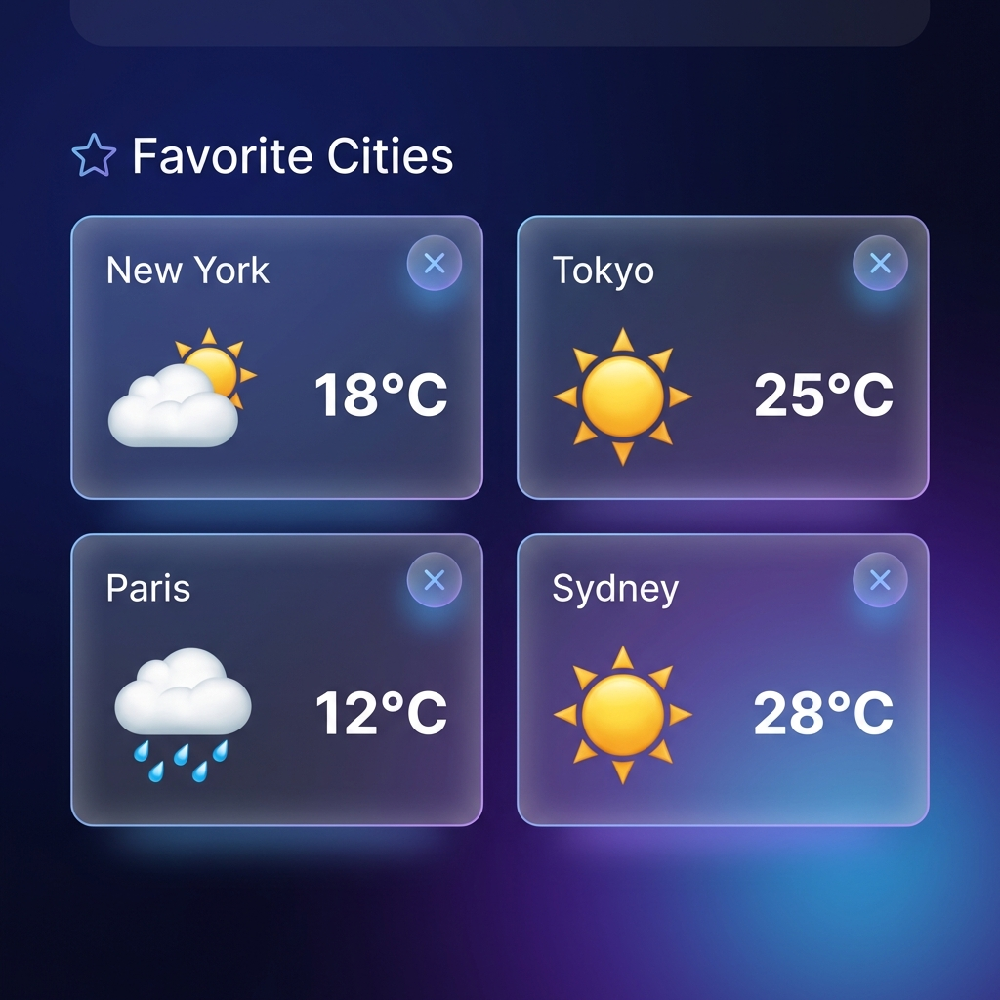

# 🌤️ Weather Dashboard

A beautiful, modern weather dashboard application that provides real-time weather data and 5-day forecasts for cities worldwide. Built with vanilla JavaScript, HTML, and CSS, featuring a premium dark theme with glassmorphism effects.



## ✨ Features

### Core Functionality
- 🔍 **City Search** - Search for weather in any city worldwide
- 📍 **Geolocation** - Automatically detect and display weather for your current location
- 🌡️ **Current Weather** - Detailed current weather conditions including:
  - Temperature (actual and feels-like)
  - Weather description with emoji icons
  - Humidity and pressure
  - Wind speed and direction
  - Visibility
  - Sunrise and sunset times
- 📅 **5-Day Forecast** - Extended weather forecast with daily predictions
- ⭐ **Favorites** - Save your favorite cities for quick access
- 💾 **Local Storage** - All preferences and favorites are saved locally

### User Experience
- 🎨 **Premium Dark Theme** - Beautiful glassmorphism design with smooth animations
- 📱 **Fully Responsive** - Works perfectly on desktop, tablet, and mobile devices
- ♿ **Accessible** - Built with accessibility best practices
- ⚡ **Fast & Efficient** - Optimized API calls and smooth performance
- 🎭 **Loading States** - Beautiful loading animations
- ⚠️ **Error Handling** - User-friendly error messages

## 🚀 Getting Started

### Prerequisites
- A modern web browser (Chrome, Firefox, Safari, Edge)
- An OpenWeatherMap API key (free tier available)

### Installation

1. **Clone or download this repository**
   ```bash
   git clone <repository-url>
   cd weather-dashboard
   ```

2. **Get your API key**
   - Visit [OpenWeatherMap](https://openweathermap.org/api)
   - Sign up for a free account
   - Generate an API key

3. **Configure the API key**
   - Open `js/api.js`
   - Replace the placeholder API key with your actual key:
     ```javascript
     API_KEY: 'YOUR_API_KEY_HERE'
     ```

4. **Run the application**
   - Simply open `index.html` in your web browser
   - Or use a local server:
     ```bash
     # Using Python
     python -m http.server 8000
     
     # Using Node.js
     npx serve
     ```

5. **Access the dashboard**
   - Open your browser and navigate to `http://localhost:8000`

## 📁 Project Structure

```
weather-dashboard/
├── index.html              # Main HTML file
├── css/
│   └── styles.css         # Complete styling with design system
├── js/
│   ├── app.js            # Main application logic
│   ├── api.js            # Weather API integration
│   └── storage.js        # Local storage management
├── screenshots/          # Application screenshots
└── README.md            # This file
```

## 🛠️ Technical Implementation

### Technologies Used
- **HTML5** - Semantic markup
- **CSS3** - Modern styling with CSS variables, flexbox, and grid
- **JavaScript (ES6+)** - Vanilla JavaScript with modern features
- **OpenWeatherMap API** - Weather data provider
- **Local Storage API** - Client-side data persistence

### Key Concepts Demonstrated

#### 1. **Async/Await & Promises**
```javascript
async searchWeather(city) {
  const [currentWeather, forecast] = await Promise.all([
    WeatherAPI.getCurrentWeather(city, this.units),
    WeatherAPI.getForecast(city, this.units)
  ]);
}
```

#### 2. **REST API Integration**
- GET requests to OpenWeatherMap API
- Error handling for different HTTP status codes
- Data formatting and transformation

#### 3. **Local Storage Management**
- Saving and retrieving user preferences
- Managing favorite cities
- Persisting last searched location

#### 4. **Geolocation API**
```javascript
navigator.geolocation.getCurrentPosition(
  async (position) => {
    const { latitude, longitude } = position.coords;
    // Fetch weather by coordinates
  }
);
```

#### 5. **Object-Oriented Programming**
- Class-based architecture
- Separation of concerns (API, Storage, UI)
- Modular code organization

## 🎨 Design System

### Color Palette
- **Primary**: `hsl(220, 90%, 56%)` - Vibrant blue
- **Secondary**: `hsl(280, 70%, 60%)` - Purple accent
- **Background**: Dark theme with multiple layers
- **Text**: High contrast for readability

### Typography
- **Font Family**: Inter (Google Fonts)
- **Responsive sizing**: Fluid typography scales

### Effects
- **Glassmorphism**: Frosted glass effect on cards
- **Animations**: Smooth transitions and micro-interactions
- **Shadows**: Layered shadows for depth

## 📱 Responsive Breakpoints

- **Desktop**: 1400px and above
- **Tablet**: 768px - 1399px
- **Mobile**: Below 768px

## 🔧 API Reference

### OpenWeatherMap Endpoints Used

1. **Current Weather**
   ```
   GET /data/2.5/weather?q={city}&units={units}&appid={API_KEY}
   ```

2. **5-Day Forecast**
   ```
   GET /data/2.5/forecast?q={city}&units={units}&appid={API_KEY}
   ```

3. **Geocoding**
   ```
   GET /geo/1.0/direct?q={city}&limit=1&appid={API_KEY}
   ```

## 💡 Usage Guide

### Searching for Weather
1. Type a city name in the search bar
2. Press Enter or click the Search button
3. View current weather and 5-day forecast

### Using Geolocation
1. Click the location button (📍) in the header
2. Allow location access when prompted
3. Weather for your current location will be displayed

### Managing Favorites
1. Search for a city
2. Click the heart icon (🤍) to add to favorites
3. Click the filled heart (❤️) to remove from favorites
4. Click any favorite card to view its weather

### Quick Actions
- Click any of the quick action city buttons for instant weather

## 🐛 Error Handling

The application handles various error scenarios:
- **City not found**: Clear error message with suggestions
- **Network errors**: Retry suggestions
- **API errors**: User-friendly explanations
- **Geolocation errors**: Permission and availability checks
- **Invalid API key**: Configuration guidance

## 🔒 Privacy & Data

- **No server-side storage**: All data is stored locally in your browser
- **No tracking**: No analytics or tracking scripts
- **API calls only**: Only communicates with OpenWeatherMap API
- **Your data stays local**: Favorites and preferences never leave your device

## 🚀 Performance Optimizations

- **Parallel API calls**: Using `Promise.all()` for concurrent requests
- **Efficient DOM updates**: Minimal reflows and repaints
- **Lazy loading**: Favorite weather loaded in background
- **Debounced search**: Prevents excessive API calls
- **CSS animations**: Hardware-accelerated transforms

## 🎯 Future Enhancements

Potential features for future versions:
- [ ] Hourly forecast
- [ ] Weather alerts and warnings
- [ ] Multiple unit systems (Celsius/Fahrenheit toggle)
- [ ] Weather maps integration
- [ ] Historical weather data
- [ ] Weather comparison between cities
- [ ] Dark/Light theme toggle
- [ ] Export weather data
- [ ] PWA support for offline access
- [ ] Weather widgets

## 📸 Screenshots

### Desktop View


### Mobile View


### Forecast Section


### Favorites


## 🤝 Contributing

Contributions are welcome! Please feel free to submit a Pull Request.

1. Fork the project
2. Create your feature branch (`git checkout -b feature/AmazingFeature`)
3. Commit your changes (`git commit -m 'Add some AmazingFeature'`)
4. Push to the branch (`git push origin feature/AmazingFeature`)
5. Open a Pull Request

## 📄 License

This project is open source and available under the [MIT License](LICENSE).

## 👏 Acknowledgments

- Weather data provided by [OpenWeatherMap](https://openweathermap.org/)
- Icons: Emoji icons for universal compatibility
- Font: [Inter](https://fonts.google.com/specimen/Inter) by Google Fonts
- Inspiration: Modern weather applications and design trends

## 📞 Support

If you encounter any issues or have questions:
1. Check the [Issues](issues) page
2. Create a new issue with detailed information
3. Include browser version and error messages

## 🌟 Show Your Support

If you found this project helpful, please consider:
- ⭐ Starring the repository
- 🐛 Reporting bugs
- 💡 Suggesting new features
- 📢 Sharing with others

---

**Built with ❤️ using vanilla JavaScript, HTML & CSS**

*Last updated: January 2026*
